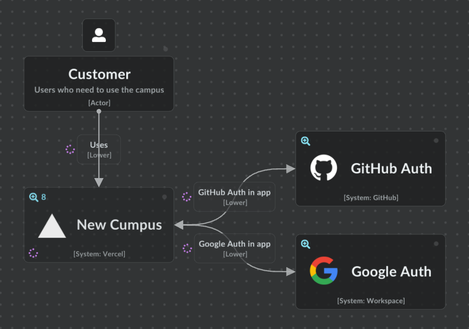
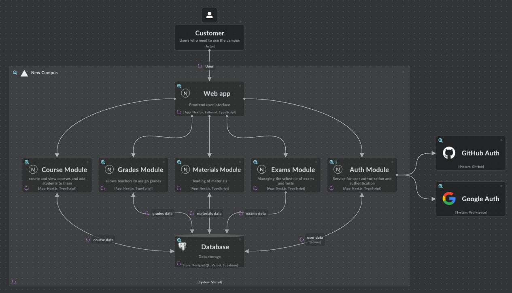
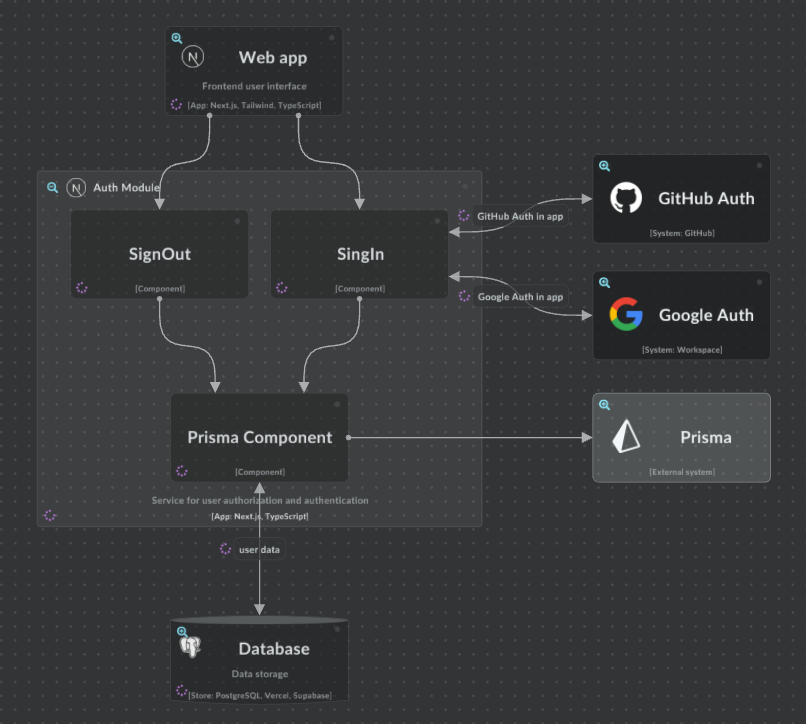

# Проектування архітектури
## Підхід: Модульна монолітна архітектура
Оскільки ми вже визначили стек технологій (Next.js, PostgreSQL, Vercel), 
логічним кроком є використання монолітної архітектури
Наша система буде складатися з кількох логічно розділених модулів, кожен з яких відповідає за свою функціональність. 
Це дозволяє легше керувати кодом і забезпечити кращу масштабованість, 
без необхідності переходу до повноцінної мікросервісної архітектури. 
Окремі модулі системи будуть взаємодіяти між собою через API-запити, 
однак усе це буде частиною одного монолітного додатка.

## Основні модулі:
- **Модуль авторизації (Auth Module):** відповідає за реєстрацію, логін і управління ролями користувачів (студент, викладач, адміністратор).
- **Модуль керування курсами (Course Module):** викладачі можуть створювати курси, студенти можуть переглядати свої курси та зареєструватися на них.
- **Модуль оцінок (Grades Module):** управління виставленням оцінок і їх перегляд студентами.
- **Модуль сесій (Exams Module):** дозволяє викладачам призначати дати екзаменів і контрольних робіт, а студентам переглядати свій розклад.
- **Модуль методичних матеріалів (Materials Module):** дає можливість завантажувати та переглядати методички з предметів.

## Причини вибору модульної монолітної архітектури:
- **Масштабованість:** Ми можемо масштабувати певні функціональні частини системи без повної реорганізації архітектури.
- **Чіткий розподіл функціональних блоків:** Кожен модуль ізольований, тому його легше підтримувати і тестувати.
- **Простота розробки:** Залишаємо загальну простоту монолітного додатку, але ділимо систему на логічні частини, щоб команди могли працювати паралельно.
- **Легка підтримка та оновлення:** Можливість оновлювати окремі модулі без впливу на інші.

## Високорівневі діаграми архітектури системи
[Високорівнева діаграма](https://s.icepanel.io/CHSyZPqQB4ZXQh/NmMV)

### Рівень 1: Діаграма контексту (Context Diagram)
На цьому рівні ми описуємо загальний контекст нашої системи, показуємо її місце у взаємодії з користувачами та зовнішніми системами.

**Користувачі (Customers)** — є три основні ролі користувачів: студенти, викладачі та адміністратори.
- **Студенти** можуть реєструватися на курси, переглядати оцінки та методичні матеріали.
- **Викладачі** створюють курси, виставляють оцінки, додають методичні матеріали та організовують екзамени.
- **Адміністратори** керують системою та користувачами, забезпечуючи загальну підтримку.

**Система навчальної платформи (NewCampus)** — це основна система, яка надає функціонал для реєстрації, керування курсами, оцінок, екзаменів та методичних матеріалів.

**Google Auth** та **GitHub Auth** — зовнішні сервіси для автентифікації користувачів, які використовують NextAuth для забезпечення безпеки при вході в систему.

### Рівень 2: Діаграма контейнерів (Container Diagram)
Цей рівень показує ключові системні модулі (контейнери), їх взаємодію та внутрішню структуру системи.

#### Веб-застосунок (Web App) ####
- Це фронтенд-застосунок, який взаємодіє з користувачами.
- Відповідає за відображення інтерфейсу та надсилання запитів до бекенду для обробки даних.

#### Бекенд (Backend) ####
Бекенд забезпечує бізнес-логіку системи.
Реалізує роботу з такими модулями:
- Модуль авторизації (Auth Module) — автентифікація користувачів через Google Auth або GitHub Auth, управління ролями.
- Модуль керування курсами (Course Module) — викладачі можуть створювати курси, студенти можуть записуватись на курси.
- Модуль оцінок (Grades Module) — дозволяє викладачам виставляти оцінки, а студентам — переглядати свої результати.
- Модуль сесій (Exams Module) — управління розкладом екзаменів та контрольних робіт.
- Модуль методичних матеріалів (Materials Module) — завантаження та перегляд матеріалів.

#### База даних (PostgreSQL) ####
- Зберігає всю інформацію про користувачів, курси, оцінки, екзамени та матеріали.
- Забезпечує доступ для бекенду через Prisma ORM.

### Рівень 3: Компонентна діаграма (Component Diagram)
Показує компоненти системи та взаємодії між ними.

#### Auth Module  ####

- **SingIn:** Компонент, який керує авторизацією за допомогою GitHub Auth і Google Auth.
- **SingOut:** Компонент, який відповідає за вихід користувача з системи.
- **Prisma Component:** Інструмент для роботи з базою даних, який підключається через NextAuth для збереження й обробки даних користувачів.